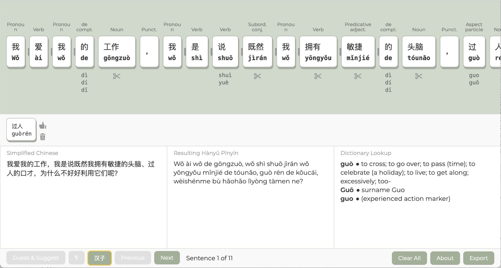

# Deterministic Hànyǔ Pīnyīn Transcription

Research project exploring deterministic, standards-compliant Hànyǔ Pīnyīn (Hànyǔ Pīnyīn) transcription workflows based on **GB/T 16159-2012** (《汉语拼音正词法基本规则》).

The project investigates publication-grade Pīnyīn rendering using:

- lexical segmentation
- POS-aware processing
- deterministic orthographic rules
- reversible editing workflows
- human-correctable transcription pipelines

## Interactive Transcription Interface

Prototype interface for deterministic transcription review, token correction, lexical merging, and orthographic normalization.

## Focus Areas

- GB/T 16159-2012 orthographic compliance
- deterministic post-processing architectures
- lexical merge validation
- publication-grade spacing and capitalization
- normalization of existing transcripts
- interactive transcription tooling

## Technologies

- Vanilla JavaScript
- HTML/CSS
- RakutenMA
- Jieba-JS
- Pīnyīn-Pro
- CC-CEDICT

## Project Page

[GitHub Pages](https://alfons.github.io/PinyinTranscriptionStudy/)

## Status

Experimental research prototypes and workflow exploration.

## Author

Alfons Grabher
